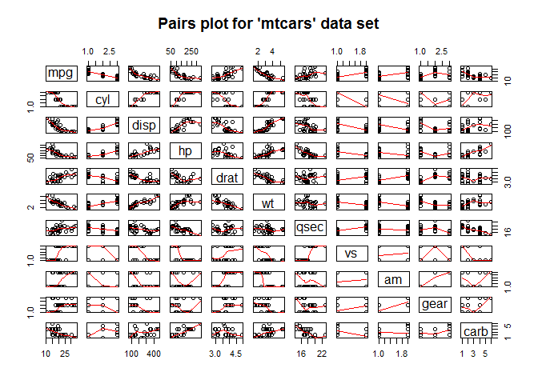
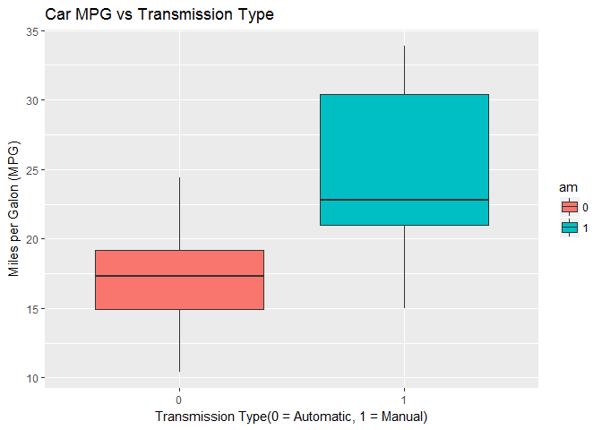

# Coursera Regression Models Project - Analysis of Transmission Type Influence on Fuel Consumption
Igor Hut  
27 mart 2016   


  
## Executive Summary 

The following analysis, i.e. the report based on it, has been conducted in order to explore, in detail, the `mtcars` data set in terms of relationship between a set of given variables and  fuel consumption. The data was extracted from the 1974 *Motor Trend* US magazine, and comprises average MPG and 10 aspects of automobile design and performance for 32 automobiles (1973?74 models). 
The main objectives of this analysis are to determine:

* Which type of transmission, manual or automatic, is preferable in terms of average fuel consumption?
* What is the difference in  average MPG when cars with automatic and manual transmissions are compared?


To address these questions we've used regression models and exploratory data analyses to find out how **automatic** (am = 0) and **manual** (am = 1) transmissions features affect the **MPG** feature. 

*In brief, our main conlusion is: **Manual transmission is preferable, in terms of lower fuel consumption, when compared to automatic transmission.***

## Basic Data Processing

In this section we load in the `mtcars` data set, look at the data and perform the necessary data transformations by factoring the necessary variables. Also the `ggplot2` is loaded as it will be used throughout the analysis. Finally the data set is attached,i.e. data frame `mtcars`, which simplifies its usage.


```r
library(ggplot2)
```

```
## Warning: package 'ggplot2' was built under R version 3.3.2
```

```r
data(mtcars)
head(mtcars)
```

```
##                    mpg cyl disp  hp drat    wt  qsec vs am gear carb
## Mazda RX4         21.0   6  160 110 3.90 2.620 16.46  0  1    4    4
## Mazda RX4 Wag     21.0   6  160 110 3.90 2.875 17.02  0  1    4    4
## Datsun 710        22.8   4  108  93 3.85 2.320 18.61  1  1    4    1
## Hornet 4 Drive    21.4   6  258 110 3.08 3.215 19.44  1  0    3    1
## Hornet Sportabout 18.7   8  360 175 3.15 3.440 17.02  0  0    3    2
## Valiant           18.1   6  225 105 2.76 3.460 20.22  1  0    3    1
```

```r
str(mtcars)
```

```
## 'data.frame':	32 obs. of  11 variables:
##  $ mpg : num  21 21 22.8 21.4 18.7 18.1 14.3 24.4 22.8 19.2 ...
##  $ cyl : num  6 6 4 6 8 6 8 4 4 6 ...
##  $ disp: num  160 160 108 258 360 ...
##  $ hp  : num  110 110 93 110 175 105 245 62 95 123 ...
##  $ drat: num  3.9 3.9 3.85 3.08 3.15 2.76 3.21 3.69 3.92 3.92 ...
##  $ wt  : num  2.62 2.88 2.32 3.21 3.44 ...
##  $ qsec: num  16.5 17 18.6 19.4 17 ...
##  $ vs  : num  0 0 1 1 0 1 0 1 1 1 ...
##  $ am  : num  1 1 1 0 0 0 0 0 0 0 ...
##  $ gear: num  4 4 4 3 3 3 3 4 4 4 ...
##  $ carb: num  4 4 1 1 2 1 4 2 2 4 ...
```

```r
mtcars$cyl <- as.factor(mtcars$cyl)
mtcars$vs <- as.factor(mtcars$vs)
mtcars$am <- factor(mtcars$am)
mtcars$gear <- factor(mtcars$gear)
mtcars$carb <- factor(mtcars$carb)
attach(mtcars)
```

```
## The following object is masked from package:ggplot2:
## 
##     mpg
```
## Exploratory Data Analysis

Afterwards, basic exploratory data analyses is performed. 
The relationships between all the variables of the dataset in the form of `pairs` plot is obtained (see figure 1 in the appendix). From the plot, it can be noticed that there is higher correlation between variables like `cyl`, `disp`, `hp`, `drat`, `wt`, `vs`, `am` and `mpg`.

Since we are interested in the effects of car transmission type on mpg, box plots of the variable `mpg` when transmisson type - `am` is `Automatic` or `Manual`, are plotted. (see figure 2 in the appendix). This plot clearly shows that manual transmission yields higher values of MPG in general.


## Inference  

Assuming that the transmission data has a normal distribution t-test is performed. It clearly shows that the automatic and manual transmissions are from different populations. 


```r
t.test(mpg ~ am, data=mtcars)
```

```
## 
## 	Welch Two Sample t-test
## 
## data:  mpg by am
## t = -3.7671, df = 18.332, p-value = 0.001374
## alternative hypothesis: true difference in means is not equal to 0
## 95 percent confidence interval:
##  -11.280194  -3.209684
## sample estimates:
## mean in group 0 mean in group 1 
##        17.14737        24.39231
```

## Regression Analysis  

In this section, linear regression models based on the different variables are built and compared in order to find out the best model fit in regard to the base model by using ANOVA. After model selection, the analysis of residuals is performed.

As mentioned earlier, based on the `pairs` plot where several variables exhibit high correlation with `mpg`,an initial model is built with all the variables as predictors, and stepwise model selection is performed in order to select significant predictors for the final model which is supposed to be the best. This is taken care by the step method which runs `lm` multiple times to build multiple regression models and select the best variables from them using both forward selection and backward elimination methods by the *AIC* algorithm. 


```r
init_model <- lm(mpg ~ ., data = mtcars)
best_model <- step(init_model, direction = "both") # results hidden
```
The best model obtained from the above computations consists of the variables, `cyl`, `wt` and `hp` as confounders and `am` as the independent variable. Details of the model are given below.


```r
summary(best_model)
```

```
## 
## Call:
## lm(formula = mpg ~ cyl + hp + wt + am, data = mtcars)
## 
## Residuals:
##     Min      1Q  Median      3Q     Max 
## -3.9387 -1.2560 -0.4013  1.1253  5.0513 
## 
## Coefficients:
##             Estimate Std. Error t value Pr(>|t|)    
## (Intercept) 33.70832    2.60489  12.940 7.73e-13 ***
## cyl6        -3.03134    1.40728  -2.154  0.04068 *  
## cyl8        -2.16368    2.28425  -0.947  0.35225    
## hp          -0.03211    0.01369  -2.345  0.02693 *  
## wt          -2.49683    0.88559  -2.819  0.00908 ** 
## am1          1.80921    1.39630   1.296  0.20646    
## ---
## Signif. codes:  0 '***' 0.001 '**' 0.01 '*' 0.05 '.' 0.1 ' ' 1
## 
## Residual standard error: 2.41 on 26 degrees of freedom
## Multiple R-squared:  0.8659,	Adjusted R-squared:  0.8401 
## F-statistic: 33.57 on 5 and 26 DF,  p-value: 1.506e-10
```
As can be seen the R-square value is 0.84 which is the maximum obtained considering all combinations of variables. This means that the model can explain about 84% of the variance of the MPG variable. 


In the following section, we compare the base model with only am as the predictor variable and the best model which we obtained earlier containing confounder variables also.

## Residual Analysis and Diagnostics  

To see the corresponding plots please refer to the **Appendix: Figure 3.** section. According to the residual plots, we can make the following observations:

* Residuals vs. Fitted plot shows points that seem to be randomly scattered which justifies the independence condition.
* The Normal Q-Q plot indicates that the residuals can be regarded as normally distributed.
* The Scale-Location plot shows points which are spread in a constant band pattern, indicating constant variance.
* In the top right of the plots outliers, i.e. leverage points can be observed.

## Conclusion

**Based on the observations from the best fit model, following conclusions can be drawn:**

* Cars fitted with Manual transmission, on average, achieve 1.8 times more miles per gallon (`mpg`) compared to cars equiped with Automatic transmission. (1.8 adjusted for hp, cyl, and wt).

* `mpg` will decrease by 2.5 (adjusted for hp, cyl, and am) for every 1000 lb increase in wt.
* mpg decreases negligibly with increase of hp.
* If number of cylinders, cyl increases from 4 to 6 and 8, mpg will decrease by a factor of 3 and 2.2 respectively (adjusted for hp, wt, and am). 


## Appendix: Figures  

**1. Pairs Plot for `mtcars` data set**  

```r
pairs(mtcars, panel=panel.smooth, main="Pairs plot for 'mtcars' data set")
```

<!-- -->

**2. Boxplot of Car MPG vs. Transmission**  

```r
ggplot(mtcars, aes(x=am, y=mpg, fill=am))+
  geom_boxplot()+
  labs(title="Car MPG vs Transmission Type",x="Transmission Type(0 = Automatic, 1 = Manual)", y = "Miles per Galon (MPG)")
```

<!-- -->
  
**3. Residual Plots**


```r
par(mfrow = c(2, 2))
plot(best_model)
```

<!-- -->
